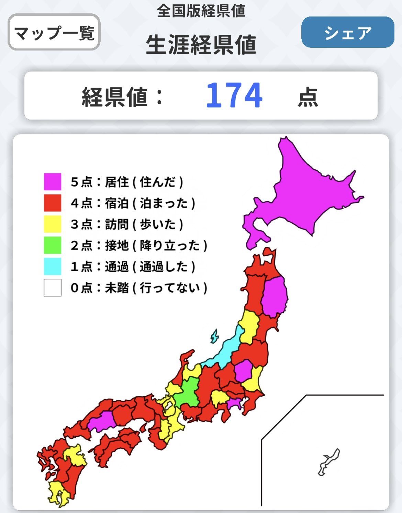

### Hello World!! 👋

I'm a journeyer going anywhere.

### 📊GitHub Status 📋
<!-- Repository Status -->
<!-- 

-->
<!-- Source Code Statistics -->

The html and css items are excluded. Since most of them are from *github.io*.

### Links/Contacts
- **Twitter**: 
- **Discord**: `huraicid`
- **Qiita**: https://qiita.com/huraicid
- **Book Meter**(読書メーター): https://bookmeter.com/users/954631

### Artifacts I used on this page
##### Hello world
- *Keikenchi(経県値)*: https://uub.jp/j.cgi
  - The Screenshot on the iOS Keikenchi app: https://qdan.hateblo.jp/entry/keikenchi
##### GitHub Status
- GitHub Stats Card & Top Languages Card: *raghazra/github-readme-stats*, https://github.com/https://shields.io/
##### Links
- Twitter Button: *shields.io*, https://shields.io/ 

<!--
**huraicid/huraicid** is a ✨ _special_ ✨ repository because its `README.md` (this file) appears on your GitHub profile.

Here are some ideas to get you started:

- 🔭 I’m currently working on ...
- 🌱 I’m currently learning ...
- 👯 I’m looking to collaborate on ...
- 🤔 I’m looking for help with ...
- 💬 Ask me about ...
- 📫 How to reach me: ...
- 😄 Pronouns: ...
- ⚡ Fun fact: ...
-->
