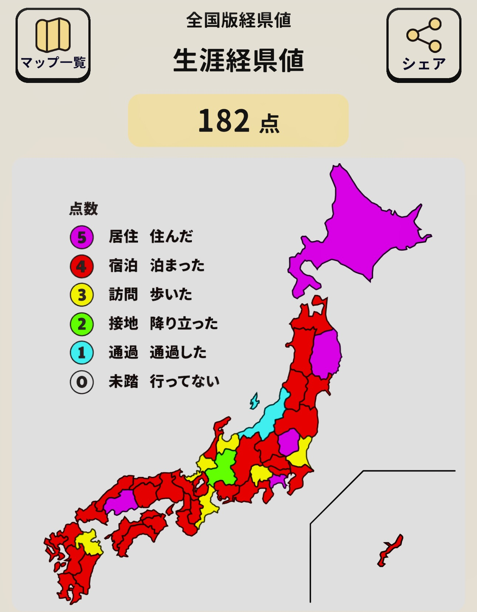

### Hello World!! 👋

<!-- -->

### 📊GitHub Status 📋
<!-- Repository Status -->

The HTML and CSS items have been excluded, as most of them are from *github.io.*

<!-- -->

---
### Skills
#### Programming Languages/Frameworks

#### Code Managements

#### Containerizations & Orchestrations

#### Databases

#### Infrastructures

#### OS

#### IDEs/Build Tools

#### Others

<!-- -->

<!--
**huraicid/huraicid** is a ✨ _special_ ✨ repository because its `README.md` (this file) appears on your GitHub profile.

Here are some ideas to get you started:

- 🔭 I’m currently working on ...
- 🌱 I’m currently learning ...
- 👯 I’m looking to collaborate on ...
- 🤔 I’m looking for help with ...
- 💬 Ask me about ...
- 📫 How to reach me: ...
- 😄 Pronouns: ...
- ⚡ Fun fact: ...
-->
